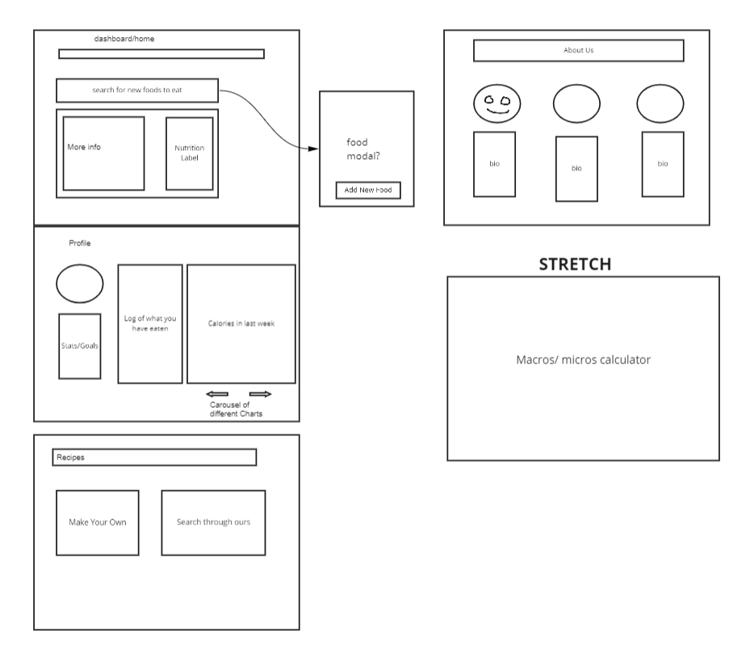
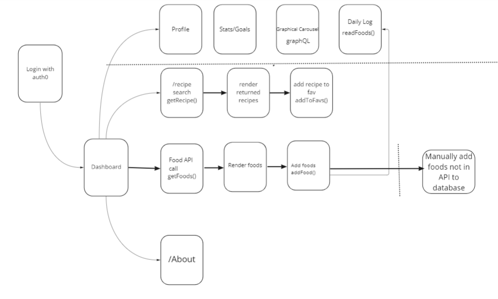

# 301n26-Final-Project

## Members
1. Luis Sandoval
2. Justin Mathieu 
3. Jim Doyle

## Cooperation Plan

1. What are the key strengths of each person on the team?
    - Luis: Frontend styling
    - Jusin: Componentization and testing.
    - Jim: Adept problem solver.  
    

2. How can you best utilize these strengths in the execution of your project?
   - Luis: Handle the bulk of frontend styling.
   - Justin: Ensuring code is easy to read and understand. 
    - Jim: Focusing my attention on the key details for the project.   

3. In which professional competencies do you each want to develop greater strength?
    - Luis: The quality competency, specifically root cause resolution.
    - Justin: Quality, craftsmanship and communication.
    - Jim: Technical skillset. While I have progressed well since I first started out, I am looking to grow my technical abilities continuously.  

4. Knowing that every person in your team needs to understand all aspects of the project, how do you plan to approach the day-to-day work? 
   - Start every workday with a meeting where we go over specific tasks we need accomplished and properly assign those tasks based on teammates strengths. End with another wrap up meeting by close of business.

## Conflict Plan

1. What will be your group’s process to resolve conflict, when it arises?
    - If there are any issues that need to be resolved, the team will meet to discuss them. Any grievances will be discussed and resolved.   
2. What will your team do if one person is taking over the project and not letting the other members contribute?
    - Similar to above, we will have a meeting to discuss the issue. Specific tasks will be re-established or re-assigned as necessary.   

3. How will you approach each other and the challenges of the project knowing that it is impossible for all members to be at the exact same place in understanding and skill level?
   - Tasks will be assigned based on skill level. If a team member is stuck on something, the others will help them get over it and teach them what they know.   

4. How will you raise concerns to members who are not adequately contributing?
   - We will have a team meeting where we again will go over teammate specific tasks to ensure that all team members are adequately contributing.   

5. How and when will you escalate the conflict if your resolution attempts are unsuccessful?
    - If conflicts cannot be resolved, and only if it is absolutely necessary, the team will go to Code Fellows staff.  

## Communication Plan

1. What hours will you be available to communicate?
    - Jim: 9AM to 10PM.  
    - Luis: 9AM to 10PM.
    - Justin: 9AM to 10PM   
2. What platforms will you use to communicate (ie. Slack, phone …)?
    - Slack group chat.   
3. How often will you take breaks?
    - One ten minute break every hour.   
4. What is your plan if you start to fall behind?
    - Reassess. Ditch our more ambitous goals.   
5. How will you communicate after hours and on the weekend?
    - Slack.   
6. What is your strategy for ensuring everyone’s voice is heard?
    - Daily meetings.   
7. How will you ensure that you are creating a safe environment where everyone feels comfortable speaking up?
    - Don't be a  jerk. 
## Work Plan

1. How you will identify tasks, assign tasks, know when they are complete, and manage work in general?
   - Once A project has been selected, the critical components for MVP will be identified and assigned to group members based on interest and skillset.   

2. What project management tool will be used?
    - Trello
## Git Process 

1. What components of your project will live on GitHub?
   - Client side and server side.   

2. How will you share the repository with your teammates?
    - Github Organization   

3. What is your Git flow?
    - Each dev on the team will checkout their own branch to work on. Pull requests will be sent to the developer branch, with pushes to the Main only being made when the developer branch has functional code.    

4. Will you be using a PR review workflow? If so, consider:
    - How many people must review a PR?
      - 2
    - Who merges PRs?
      - Merges can be done by anyone on the team. 
    - How often will you merge?
      - At the end of a work session.
    - How will you communicate that it’s time to merge?
      - We will merge at the end of every work session.

## Project Prep Deck 

[Final Project Deck](https://docs.google.com/presentation/d/1dWolPdbrgHnupMhS6balcW6C11EsglGrzgB6pRs1ZUo/edit?usp=sharing)

## Wireframe

## Domain Modeling

## Database Schema Diagram

