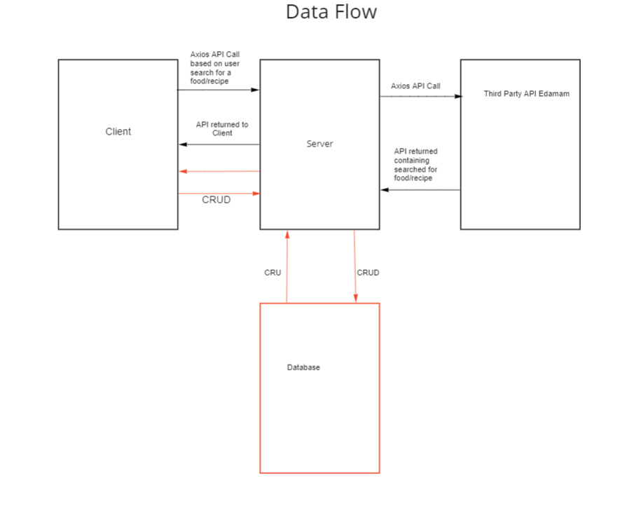

# Requirements

## Vision

   To allow users to easily keep track of their calories and tack back control of their health. Writing out macros for each food you eat throughout the day can be a real pain, and this would allow a more streamlined way of keeping track of the users diet. If used correctly, this can help the user mitigate their chances of developing any one of a number of ailments that plague millions of people around the world.

## Scope

IN - What will your product do

- The web app will provide information to the users about the food that they search for.
- The web app will provide recipes to the user based on their dietary preferences.
- The web app will calculate for the user their total daily intake of calories.
- The web app will calculate for the user their total micro and macro nutrients.
  
OUT - What will your product not do.

- Our product will not provide a diet plan.

### Minimum Viable Product

- An app that allows users to search for foods and add them to their food log. The user will be able to read, update, and delete the foods added to the log.

### Stretch

- Graphically show metrics to the user such as calorie consumption, weight lost over time.
- Include a calculator to generate recommended micros/macros based on user input.
- Allow users to filter foods based on medical, religious, and other dietary restrictions such as kosher, halal, vegan, etc.
- Have a profile page for user.

## Functional Requirements

- Auth0 authentication for creating user profiles.
- A user can search all of the foods in the API.
- A user can add/update/delete food from their daily log.

### Data Flow

## Non-Functional Requirements

- Security: Users should be able to have their food logs private so that only they can see it. 
- Useability: The basic search function should work in a similar fashion to other search bars. Buttons, pages, and other functions will be properly labeled so that the user can intuitively know what they are. Without this, features could be implemented that the user may not know how to use everything on the app.
